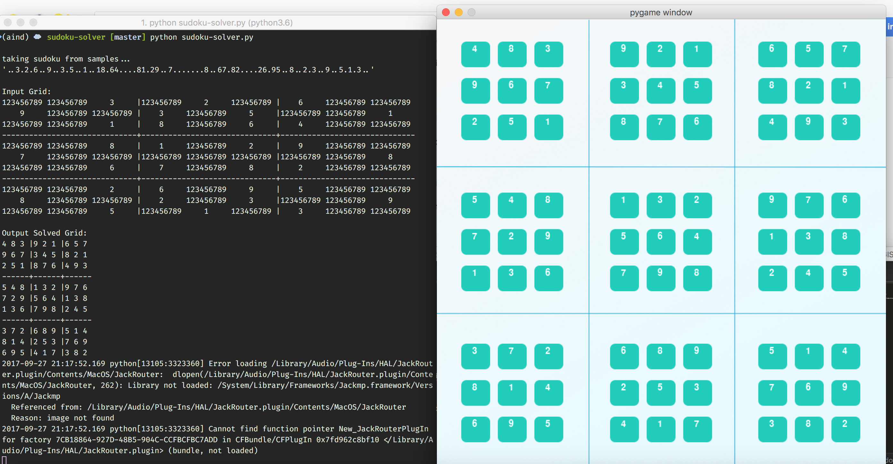

# Artificial Intelligence Sudoku Solver

## Installation
1. Go to your directory.
2. `git clone https://github.com/dancodery/sudoku-solver.git`
3. `cd sudoku-solver`
4. Download and set up https://www.anaconda.com/download/
5. `conda info` to verify you installation was successful
6. Create a conda environment from the file `conda env create -f aind-environment-macos.yml`
7. Activate this environment `source activate aind`
8. Start `python sudoku-solver.py`
9. ? Download and install http://www.pygame.org/download.shtml if the graphical user interface is not starting on its own.

## Usage

* `python sudoku-solver.py` will load the sudoku solver with an easy sudoku from the samples
* `python sudoku-solver.py '4.....8.5.3..........7......2.....6.....8.4......1.......6.3.7.5..2.....1.4......'` is your way of filling in your own sudoku which will be solved. It requires 81 characters inside of single quotation marks.
* `python sudoku-solver.py --diag '2.............62....1....7...6..8...3...9...7...6..4...4....8....52.............3'` is solving your feeded in sudoku. But it will also check the diagonal lines inside of the given sudoku. So from left-top to right-bottom and from left-bottom to right-top.
* `python sudoku-solver.py -h` is showing the help

## Documentation

The program is based on the Udacity.com Nanodegree Program 'Artificial Intelligence'.

In the highest level of solving the sudoku it uses **depth-first search and propagation** to try all possible values. 
But it is not just brute forcing all possible values. It begins to be more sophisticated in the lower levels. In the lower levels the program uses constraint propagation techniques to solve cells inside the sudoku.
So on the highest level, Depth-first search means that the program tries out and is coming back from guesses made by the program.
It is trial and error.
Imagine you have a sudoku and it is not solved yet. You can't make any progress anymore, because the underlaying techniques (eliminate, naked twins, only choice) make no progress anymore. But you have one certain cell with two possible digits. It makes sense to try out one of these two digits to see what impact it has on further predictions and if the sudoku can finally be solved. Thus if you can't go further anymore because it contradicts itself on further steps, you know that in this first cell there must be the second digit filled in.

The underlaying level **'constraint propagation'** is executed until it makes no progress anymore. It consists of 1. Eliminate, 2. Naked Twins and 3. Only Choice

A sudoku consists of 9 rows and 9 columns. We label the rows from A-I and the columns from 1-9.
The cell D5 means the cell in the fifth column and the fourth row.

### Eliminate

The elimination function looks for single digits which are contained in its peers as a possibility.
A peer are neighbors in any unit.

The udacity course is based on http://norvig.com/sudoku.html

Copyright 2017 **© Daniel Gockel**